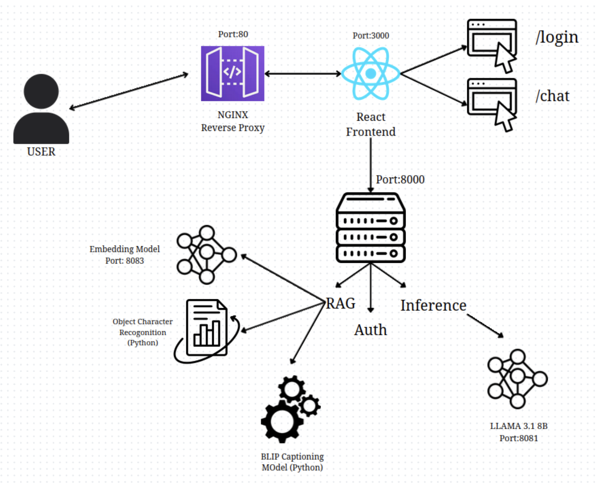

# 🔰 Varuna AI – Secure RAG Chat Assistant (Air-Gapped)

Varuna AI is a secure, offline-capable **Retrieval-Augmented Generation (RAG)** assistant built for air-gapped environments. Leveraging **LLaMA 3.1 8B**, FAISS, OCR, BLIP, and LangChain, it enables **document-grounded AI chat** across PDFs, Word docs, tables, and image-based inputs.

> 📍 Developed for air-gapped on-premise use-cases; optimized for secure deployments with no internet dependency. All components run in isolated environments using `llama.cpp`, `FastAPI`, `React`, and `NGINX`.

---

## 🧠 Key Features

- 🔒 **Air-Gapped Ready**: Fully offline-capable, no external API or internet dependency  
- 📄 **Multimodal RAG**: Document, image, OCR, and table-based information retrieval  
- 🧠 **LLM-Powered Chat**: Fast CPU-based inference using quantized LLaMA 3.1 8B  
- ⚙️ **End-to-End RAG Pipeline**: From document upload → chunking → embeddings → vector DB → LLM query response  
- 🧾 **Visual Document Parsing**: BLIP captioning + OCR (EasyOCR)  
- 🌐 **Intuitive UI**: Built with ReactJS + Tailwind; session-based chat with multi-document support  
- 🛡️ **User Authentication**: Secure login, session ID management, document isolation  
- 📊 **Scalable Microservices**: Embedding, inference, chat API, and UI run as independent services  

---

## 🧱 System Architecture

### 🧠 RAG Pipeline


1. **Docs** parsed and chunked  
2. **Embeddings** generated and stored in FAISS  
3. **User query** is embedded and searched  
4. Retrieved chunks passed to **LLM** for final response generation  

---

### 🔐 Full Deployment Architecture



| Component       | Description                             |
|----------------|-----------------------------------------|
| `Frontend`      | React (Port: 3000)                      |
| `Backend`       | FastAPI (Port: 8000)                    |
| `Inference`     | LLaMA 3.1 (Port: 8081 via `llama.cpp`)  |
| `Embeddings`    | `nomic-embed-text` (Port: 8083)         |
| `OCR`           | EasyOCR                                 |
| `Image Caption` | BLIP (for images)                       |
| `Gateway`       | NGINX reverse proxy (Port: 80)          |
| `Storage`       | SQLite, Session store, FAISS            |

---

## 🗂️ Repository Structure

```bash
.
├── backend/                 # FastAPI backend - core logic
│   ├── main.py              # Auth + Inference APIs
│   ├── users.db             # SQLite DB
│   └── ...                 
├── frontend/                # React frontend
│   └── /chat /login         # Pages + components
├── models/                  # LLM + embedding model configs
│   ├── llama-3.1-8b.gguf
│   └── nomic-embed-text-v1.gguf
├── llama.cpp/               # LLaMA.cpp binary & compiled engine
├── documentation/           # Diagrams, PDFs, architecture docs
├── requirements.txt         # Python dependencies
├── get-pip.py               # Setup script
├── startup_services.sh      # Bash script to run services
└── README.md
```

---

## ⚙️ Tech Stack

- **Frontend**: ReactJS, TailwindCSS, Streamlit (combined dashboard)  
- **Backend**: FastAPI, Python, SQLite  
- **LLM**: LLaMA 3.1 8B (Quantized `.gguf`) via `llama.cpp`  
- **Embeddings**: nomic-embed-text-v1 (Q4_K_M)  
- **Vector DB**: FAISS with BM25 + Dense search  
- **OCR/BLIP**: EasyOCR, BLIP model (image captioning)  
- **Deployment**: NGINX reverse proxy, systemd services, bash  

---

## 🚀 Local Deployment Guide (Offline)

> ✅ Works fully offline on CPU (no GPU needed)

### 1️⃣ Prerequisites

- Python 3.10+  
- NodeJS 18+  
- `llama.cpp` compiled  
- `serve` installed (`npm install -g serve`)  
- NGINX  

---

### 2️⃣ Run the Services

```bash
# Backend
cd backend
python3 main.py

# Frontend
cd frontend
npm install
npm run build
PORT=3000 serve -s build

# Inference (Port: 8081)
./llama.cpp/build/bin/llama-server \
  -m models/llama-3.1-8b.Q4_K_M.gguf \
  --port 8081 --chat-template llama3

# Embeddings (Port: 8083)
./llama.cpp/build/bin/llama-server \
  -m models/nomic-embed-text-v1.Q4_K_M.gguf \
  --port 8083 --embeddings

# NGINX (Port: 80)
sudo nginx -c /etc/nginx/nginx.conf
```

---

## 🧪 Core API Endpoints

| Endpoint                         | Method | Functionality                       |
|----------------------------------|--------|-------------------------------------|
| `/register`                      | POST   | New user registration               |
| `/login`                         | POST   | Login user                          |
| `/logout`                        | POST   | Logout session                      |
| `/message/stream`                | POST   | RAG-based chat generation           |
| `/rag/upload/{session_id}`       | POST   | Upload and ingest document          |
| `/rag/session/{id}/tables`       | GET    | Extract tabular data                |
| `/rag/sessions`                  | GET    | View all active sessions            |

---

## 🧾 Supported Inputs

- PDF, DOCX, TXT files  
- PNG, JPG, JPEG (with OCR + BLIP captioning)  
- Tables (via `pdfplumber` and docx parsers)  

---

## 📈 Optimizations

- 🔸 Quantized models for fast CPU inference  
- 🔸 Custom chunking + semantic splitting  
- 🔸 Parallel OCR + table extraction pipeline  
- 🔸 Session cache & document reuse  
- 🔸 Auto-cleanup of idle sessions  

---

## 📌 Sample Use Cases

- 📄 Internal document QA (govt/legal/medical)  
- 🔐 Confidential chat systems (air-gapped)  
- 📑 Legal & financial doc analysis  
- 🧠 Private GPT-style assistant with file upload  
- 🛡️ Air-gapped RAG deployments  

---

## 🛠 Future Roadmap

- 🧠 Agentic RAG + function calling  
- 🗃️ Multi-file multi-session querying  
- 🔐 RBAC (Role-Based Access Control)  
- 📦 Docker & Kubernetes deployment  
- 🌐 Enterprise dashboard analytics  

---


## 🙌 Acknowledgements

Built for the Ministry of Defence (Naval R&D) to enable **confidential LLM deployment in offline environments** using fully local components and RAG-based architectures.

---

## Author

> **Shushant Kumar Tiwari**  
> ✉️ shushantkumar164@gmail.com  
> 🔗 [LinkedIn](https://linkedin.com/in/shushant-tiwari-ai)  
> 🧠 AI Engineer | LLMOps | MLOps | RAG
---
